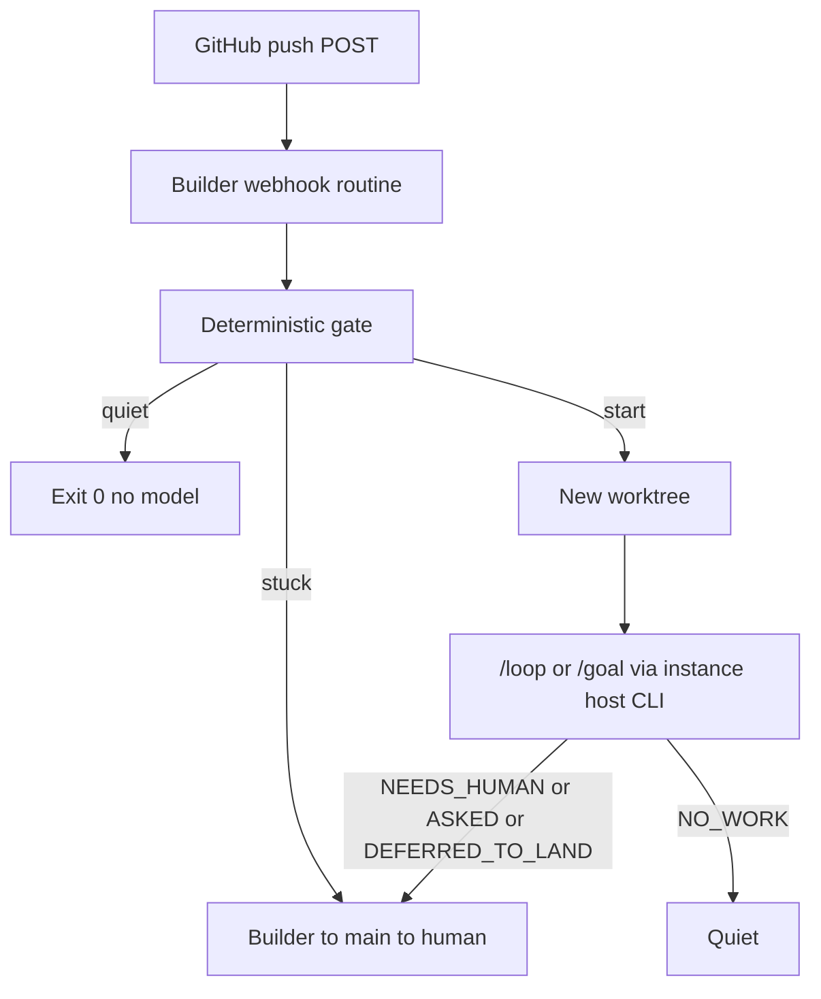

# fn-1-grok-bot-factory Grok Bot factory

## Overview

A GitHub **push** on a member repo can start a factory tick. A push with nothing ready stays quiet — no model, no ping. Easy-install is **fn-2**; this spec must run from a hand-wired wake so fn-2 can be ready work the factory builds.

**This repo ships the factory program** (deterministic gate, tick runner, notify). It is not runbook-or-skill-only. Grok Bot skills/instructions invoke that program; they are not a substitute for the gate. Product work happens in a documented flow-next host (`/loop` or `/goal` calling `/flow-next:pilot` or `/flow-next:land`), not in Grok Bot chat. The builder owns the webhook routine and supervises.

## Goal & Context
<!-- scope: business -->

Factory runtime: a push on a member repo can start a tick; a push with nothing ready stays quiet. [user]

Easy-install is **fn-2**. This spec must work with a hand-wired wake. fn-2 can then be ready work this factory builds. [user]

Only flow-next-**ready** specs/tasks are in the queue. The instance owner marks ready. The supervisor does not promote. [user]

The **builder** Grok Bot agent supervises. A documented flow-next host CLI runs `/loop` or `/goal` (`/flow-next:pilot` once per tick until `NO_WORK`, `NEEDS_HUMAN`, or `DEFERRED_TO_LAND`). Product work does not happen in Grok Bot chat. [user]

Notify only when stuck or owner-gated. Else quiet. [user]

## Approach

Ship a small deterministic **gate** plus a **tick runner** as code in this repo. The gate is a program (not a model, not a prompt).

**Pre-model execution is a prerequisite (R3, R5).** The wake must run the gate program with zero model tokens and use its exit code. There is no model-first fallback. If a Grok Bot webhook routine cannot exec a command before any model, stop and rethink the wake — do not implement “start a model whose first tool is the gate.” A non-production proof (fixture + documented routine-first-command) is part of the early proof; implementing the quiet path as a model call fails R3/R5.

**Fire path vs discovery path (do not conflate):**

- On fire, inspect **that repo only** (R4). Membership of one repo is a single check, not a fleet scan. Listing every `.flow/` repo is fn-2 (and default membership *configuration*), never the wake path.
- Quiet path: no clone. Read `.flow/` and flow-next sidecars at the firing commit through GitHub Contents (`gh api` / `gh repo read-dir`). Clone or worktree only after the gate says **start**.

**Identity (R2):** the gate’s public input is a GitHub **push** object as documented by GitHub, not a Grok-invented schema. Closed schema: `repository.full_name` is a string matching `owner/name` (`[A-Za-z0-9._-]+/[A-Za-z0-9._-]+`); `after` is a 40-char lowercase hex SHA (all-zero means deleted); `ref` is a string; `deleted` is boolean if present. Wrong JSON types, extra command characters, or failed grammar → missing-identity → **quiet** (no fleet-scan, no ping). Pass validated values as argv (quoted); never `eval` the payload. If the routine wraps GitHub JSON, an instance adapter may unwrap to this object; this spec does not name wrapper fields.

**Gate outcomes:**

| Outcome | When | Tokens | Notify |
|---------|------|--------|--------|
| quiet | ping; deleted ref (`deleted` or `after` all-zero); missing identity; repo not a member; no `ready` specs/tasks on that commit | zero | no |
| start | member repo has at least one selectable ready spec/task (`pilot` or `land`) | host loop only after this | no |
| stuck | cannot decide (transport/5xx/malformed API or sidecar JSON/partial read/403/`gh` auth/429 after retry), or host/review pin cannot be fulfilled | no substitute CLI | yes — exit 20 maps to `NEEDS_HUMAN` |

Exit contract (signature): quiet `0` only when a quiet case is **positively established**; start `10` with stdout `repo<SP>sha<SP>kind` (`kind` is `pilot` or `land`); stuck `20` with a short reason on stderr. No other GitHub flag names. Undeclared exit codes are bugs.

**Kind selection (R3, R8):** inspect ready sidecars at `after` for **that repo only**.
- `land` if at least one ready spec is land-selectable (all of its tasks are `done` and an open PR exists for its branch).
- else `pilot` if at least one ready spec or task is pilot-selectable (ready, not all-done, or all-done without an open PR).
- mixed land+pilot → `land` first (finish in-flight ship before new build).
- ready items that cannot be classified → stuck, do not guess.

**Membership (R7):** configurable. Default: this firing repo is a member if `.flow/` exists at `after` (one Contents call). Whitelist overlay is instance config — no frozen allowlist in this repo, no filename invented here. 404 on `.flow/` → not a default member → quiet. 403 → stuck, not quiet.

**Ready (R6):** a spec/task is queued only when its sidecar `ready` is true. The supervisor never writes ready. Deps, claims, or an open PR may still yield `NO_WORK` after start; that is the host loop’s job, not a reason to skip the gate.

**Tick (R8, R12–R14):** isolated worktree (or clone) per tick at the firing commit, then the host’s spec-branch rules. Parallel ticks allowed; claims skip work another actor holds; two ticks must not share a working tree.

Split the “setup pin” (R13) from the host binary (R14):
- **Review pin** = the product checkout’s `.flow/config.json` `review.backend` and instruction-file routing block. Documented backends only. Do not overwrite. Unfulfillable review pin → stuck.
- **Host CLI** = instance input (flag/env): an executable from the documented host set that actually provides `/loop` or `/goal` (land uses `/flow-next:land`). Default = a CLI already on the builder machine. Do **not** infer the host from `review.backend`. If that CLI is missing or cannot provide `/loop`/`/goal`, stuck — no substitute guess. Cloud Agents only if that instance CLI cannot run. Grok Build is a valid host. It has /loop and /goal. /loop is a recurring interval that wakes the agent, same idea as Claude Code.

Worktree allocation is atomic (unique directory per tick), contained under a factory worktree root (`realpath`; refuse symlinks that escape). If ticks share a clone’s git dir, take a narrow per-repo lock around `worktree add`/`remove` only — not a factory-wide one-tick mutex. Do not force-remove dirty trees.

Each tick has a local id and local structured logs (repo, sha, kind, phase, host verdict, stuck reason, cleanup). Logs are not progress pings.

**Notify (R9–R10):** only `NEEDS_HUMAN`, `ASKED`, or owner-gated send/pay/publish/merge (including `DEFERRED_TO_LAND` as owner-gated merge). Path: builder → main (Grok Bot handoff) → human. Map to `NEEDS_HUMAN`: gate or runner exit `20`, dirty-tree / `BLOCKED` at tick start. Preserve the stuck reason. Progress pings are out.

**Self-wake:** a factory `git push` may re-fire. That is allowed (R12). If the new push has nothing selectable, the gate is quiet.



Rejected as overkill: factory HTTP listener; factory HMAC; clone-then-`flowctl` on the quiet path; factory-wide mutex; inventing a Grok Bot REST client; extra operator manual beyond README.

## Architecture & Data Models
<!-- scope: technical -->

Wake: GitHub repo webhook, **push** only, POSTs to a Grok Bot routine `{ "type": "webhook" }`. [user]

- **Builder** owns the routine, runs the factory, invokes the host CLI. [user]
- **Main** is the first stuck-notify hop (may resolve from known intent, else a human). Both agents use Grok Bot learning infra. [user]

On fire: untrusted GitHub push body → deterministic gate (no model) uses **repo + commit** from the wake → checks **that repo only** for ready work. Quiet if none. Else builder starts `/loop` or `/goal` on a checkout, using the **instance host CLI** and the product repo’s **review** pin. [user]

Any git ref may wake. Multiple ticks may run in parallel, including on the same repo. Isolation is flow-next claims plus a separate checkout/worktree per tick — not a factory mutex. [user]

Membership is configurable. Default: instance GitHub account repos that have `.flow/`, via `gh`, no clone. Whitelist fallback. Storage filename is instance config, not this spec. [user]

Review backend = whatever flow-next 4.5.1 already documents; the product repo’s flow-next:setup **review** pin wins (do not overwrite). Host CLI is instance-configurable (R14), restricted to that same documented host inventory, and is **not** stored in the setup pin. If the review pin cannot be fulfilled, or the instance host cannot provide `/loop`/`/goal`, stuck path — no substitute guess. Default host is the CLI the builder machine can already run. Cloud Agents only if that CLI cannot. [user]

Grok Bot authenticates the POST (sender key). Factory code does not. [user]

Grok Automations webhooks (Standard Webhooks HMAC) are a different product. Do not mix them with this Grok Bot routine.

## API Contracts
<!-- scope: technical -->

Routine trigger (panel):

```json
{ "type": "webhook" }
```

Manual hook: Payload URL = routine URL, Secret = sender key, Events = push only. Content type `application/json`. First delivery is GitHub `ping` — not work. [user]

**Identity contract** (official GitHub push object only — not invented Grok fields): `repository.full_name`, `after`, `ref`, `deleted`. Headers such as `X-GitHub-Event` may be absent from the body; if the body is not a push object, missing-identity → quiet. Do not use Events API names (`head`, `repository_id`). [user]

Gate outcomes: quiet | start a tick on that repo | stuck path if identity/membership/ready cannot be decided or the repo pin cannot be fulfilled. [user]

Hosts: Claude Code, Codex, Droid, OpenCode, Grok Build, Cursor. Review: `rp` / `codex` / `copilot` / `cursor` / `host` / `none`. Form `backend[:model[:effort]]` (`cursor` is `cursor:<model>` only). Routing: repo `.flow/config.json` and `flowctl spec|task set-backend`. [user]

Secrets, routine URL, sender key: not in git. [user]

## Edge Cases & Constraints
<!-- scope: technical -->

- Never start a model to interpret the payload. [user]
- Missing repo+commit: do not scan all repos. Quiet (no ping). [paraphrase]
- Missing instance host CLI, or a host that cannot provide `/loop`/`/goal`: stuck path, no guess. [user]
- `git -c` author allowed. No force-push, no git config/remote edits. [user]
- Deleted refs and GitHub `ping`: quiet.
- Contents 404 vs 403: 404 = no `.flow/` (quiet); 403 = stuck.
- `ASKED` is notified when it appears; do not widen `pilot.autonomy` to create it.
- Native Grok `host` review fails closed for a Grok writer — if that is the pin and it cannot be fulfilled, stuck (R13), no substitute.

## Quick commands

```bash
# Fixture gate: GitHub push, nothing ready → quiet (exit 0), no gh fleet-scan.
# Implementer lands the concrete invocation in factory tests; this is the smoke.
# Do not POST to a live GitHub hook or a live Grok Bot routine.
tests/factory/gate.test.sh
```

## Boundaries
<!-- scope: business -->

- Easy-install is fn-2. [user]
- Do not arm a production wake as part of implementing this spec. [user]
- Out of scope here: dashboard screens, Cursor GitHub listeners as the wake, a factory HTTP listener, a poll as the factory, factory-side HMAC, a new GitHub/git bot, inventing payload field names, inventing instance-config filenames. [user]
- Out of scope: operators.md as a required second manual (README stays the public surface).
- Out of scope: automatic merge. `DEFERRED_TO_LAND` notifies (owner-gated).

## Decision context
<!-- scope: both -->

### Motivation
<!-- scope: business -->

The factory has to run without an installer so fn-2 can be built by it. [user]

### Implementation Tradeoffs
<!-- scope: technical -->

- Split: fn-1 runtime, fn-2 setup, fn-2 depends on fn-1. [user]
- R-IDs on this spec are R1–R15 in reading order. Old gaps were dropped criteria, not missing work; nothing had been review-judged. [user]
- Cut from ACs (now Boundaries or implied): install steps, routine-panel UI, confirm card, Cursor-listener negation, cron negation, dashboard, HMAC, “don’t arm” as a criterion, host/backend laundry lists, duplicate routing ACs. [user]
- Parallel ticks are allowed. flow-next does not forbid them: one `/flow-next:pilot` call is one spec/one stage; `/loop` and `/goal` may run concurrently. Isolation is claims + worktrees (`docs/teams.md` parallel work). [user]
- Quiet-path ready check is GitHub Contents at `after`, not clone-then-flowctl: clone is a start-path cost.
- Missing-identity and non-push bodies are **quiet** (R5 + no fleet-scan), not notify: garbage POSTs must not page anyone.
- Gate identity uses GitHub’s published push fields plus a closed type/grammar check. That is documentation, not invented Grok Bot names (R2).
- No public Grok Bot REST is required for fn-1; the routine already exists when hand-wired.
- Model-first “exec the gate as the first tool call” was rejected: it spends tokens on the quiet path and fails R3/R5.
- Host CLI is instance-configurable (R14), not a field in `.flow/config.json`. The product setup pin that must not be overwritten is the review backend + routing block (R13).

## Acceptance Criteria
<!-- scope: both -->

- **R1:** Wake is a GitHub push hook POSTing to a Grok Bot webhook routine. Manual wiring is enough. Setup is fn-2. [user] Errors: requiring easy-install before the factory can run fails this criterion.

- **R2:** `<webhook_event>` is untrusted. Do not invent field names. [user] Errors: treating unverified GitHub key names as contract fails this criterion.

- **R3:** A deterministic gate runs before any model and decides whether a tick could run (`pilot` or `land`). [user] Errors: starting a model to “see if anything is ready” fails this criterion.

- **R4:** Gate checks only the firing repo (repo + commit from the wake). Do not scan all member repos. [user] Errors: fleet-scan on each fire fails this criterion.

- **R5:** Nothing ready on the firing repo → quiet, zero model tokens, no status ping. [user] Errors: scanning / picked-up / still-running / PR-opened pings fail this criterion.

- **R6:** Only flow-next-ready specs/tasks are queued. Drafts are ignored. The supervisor does not mark ready. [user] Errors: treating an unready spec as work fails this criterion.

- **R7:** Repo set is configurable. Default = instance GitHub repos with `.flow/`. No frozen allowlist in this public repo. [user] Errors: a hardcoded allowlist in this repo fails this criterion.

- **R8:** Builder supervises only. Host is `/loop` or `/goal`. `/flow-next:pilot` is one tick, repeated until `NO_WORK`, `NEEDS_HUMAN`, or `DEFERRED_TO_LAND`. [user] Errors: product work in Grok Bot chat fails this criterion.

- **R9:** Builder owns the routine and runs the factory. Main is the stuck-notify hop, not the routine owner. [user] Errors: main owning the routine as the happy path fails this criterion.

- **R10:** Notify only on `NEEDS_HUMAN`, `ASKED`, or owner-gated send/pay/publish/merge. Path is builder → main → human if main cannot resolve. Else quiet. [user] Errors: progress pings fail this criterion.

- **R11:** Any git ref may wake. [user] Errors: default-branch-only as the product default fails this criterion.

- **R12:** Multiple ticks may run in parallel, including on the same repo. Each tick uses its own checkout/worktree. Flow-next claims skip work another actor already holds. Two ticks must not share a working tree. [user] Errors: a factory-wide one-tick lock, or two ticks mutating the same checkout, fails this criterion.

- **R13:** The product repo’s flow-next:setup **review** pin wins (review backend + routing block; documented backends only). Do not overwrite it. Host CLI is not in that pin — it is the R14 instance input, restricted to documented flow-next hosts. If the review pin cannot be fulfilled, or the instance host is outside that inventory / cannot provide `/loop` or `/goal`, stuck path — no substitute CLI. [user] Errors: overwriting the review pin, or inferring a host from `review.backend`, fails this criterion.

- **R14:** CLI location is instance-configurable. Default is the host Grok Bot can already run, if the CLI is there. Cloud Agents only if that CLI cannot. [user] Errors: Cloud Agents as the happy path fails this criterion.

- **R15:** Routine URL, sender key, tokens, PATs, sessions, and vault paths are not written to git. [user] Errors: reject any change that embeds them.

## Early proof point

Task fn-1-grok-bot-factory.1 proves the quiet path: fixture GitHub push JSON in, no clone of other repos, exit 0 when nothing is ready, and the gate is a program (zero model tokens). If that fails, do not build the tick runner. If a Grok Bot routine cannot invoke that program before any model, rethink the wake before fn-1.2.

## Requirement coverage

| Req | Description | Task(s) | Gap justification |
|-----|-------------|---------|-------------------|
| R1  | Hand-wired GitHub push → Grok Bot webhook routine is enough | fn-1-grok-bot-factory.1, fn-1-grok-bot-factory.3 | — |
| R2  | Untrusted body; no invented field names | fn-1-grok-bot-factory.1 | — |
| R3  | Deterministic gate before any model (pilot or land) | fn-1-grok-bot-factory.1, fn-1-grok-bot-factory.3 | — |
| R4  | Firing repo only; no fleet-scan | fn-1-grok-bot-factory.1 | — |
| R5  | Nothing ready → quiet, zero tokens, no ping | fn-1-grok-bot-factory.1 | — |
| R6  | Only flow-next-ready items queued; supervisor does not promote | fn-1-grok-bot-factory.1 | — |
| R7  | Configurable membership; default `.flow/` via gh; no frozen allowlist | fn-1-grok-bot-factory.1 | — |
| R8  | Builder supervises; host is /loop or /goal; pilot is one tick | fn-1-grok-bot-factory.2 | — |
| R9  | Builder owns routine; main is stuck hop | fn-1-grok-bot-factory.3 | — |
| R10 | Notify only NEEDS_HUMAN / ASKED / owner-gated | fn-1-grok-bot-factory.3 | — |
| R11 | Any git ref may wake | fn-1-grok-bot-factory.1 | — |
| R12 | Parallel ticks; own worktree; claims skip held work | fn-1-grok-bot-factory.2 | — |
| R13 | Product review pin wins; host CLI is instance input; unfulfillable → stuck | fn-1-grok-bot-factory.2 | — |
| R14 | CLI location instance-configurable; Cloud Agents last | fn-1-grok-bot-factory.2 | — |
| R15 | No secrets / routine URL / sender key / vault paths in git | fn-1-grok-bot-factory.3 | — |

## Open questions

- Instance-config filenames (membership overlay, host CLI path) stay instance-local — not named in this repo.

## References

- GitHub push payload: https://docs.github.com/en/webhooks/webhook-events-and-payloads#push
- GitHub Contents API: https://docs.github.com/en/rest/repos/contents
- `gh repo read-dir` (no clone): https://cli.github.com/manual/gh_repo_read-dir
- git-worktree: https://git-scm.com/docs/git-worktree
- flow-next 4.5.1 hosts/backends: plugin `docs/platforms.md`; pilot: https://flow-next.dev/skills/pilot/
- flow-next setup does not overwrite an existing review pin or routing block: plugin `skills/flow-next-setup/workflow.md`
- Grok Bot routines (UI): https://docs.x.ai/grok-bot/skills-routines-and-automations
- Do not use Grok Automations webhooks: https://docs.x.ai/grok/automations/webhooks

## Parked unknowns

- Instance-config filenames

## Conversation Evidence

> user: if we split it such that the actual factory works as a separate lean spec (without simple install) then the simple install could run within the factory already.

> user: then we should do setup as fn-2

> user: it's way to large of a spec we need to simplify and I think split somehow

> user: looks good but check if we can't cut some reqs. Stuff like "we're not doing this" is often just superfluous.

> user: ideally the webhook specifies which repo and which commit fired it

> user: it should respect the setup in the repo that was defined by flow-next:setup

> user: grok bot should provide the infra to be able to learn and that should be leveraged

> user: and btw multiple ticks should be fine. nothing in flow next disallows multiple in parallel i don't think? but check

## Resolved via Codebase

- Starting tree is runbook + spec only; this plan adds the factory program. flow-next 4.5.1 `docs/platforms.md` is the host/backend inventory. This repo’s `review.backend` pin is instance, not product lock.
- Parallel ticks: `docs/teams.md` “Parallel work from one spec” — claims protect ownership, not a shared checkout; concurrent workers use isolated workspaces. Pilot `workflow.md`: one invocation advances one spec one stage; that is the tick primitive, not a mutex. Collision skip is other-actor `in_progress` claims, not “repo already ticking.”
