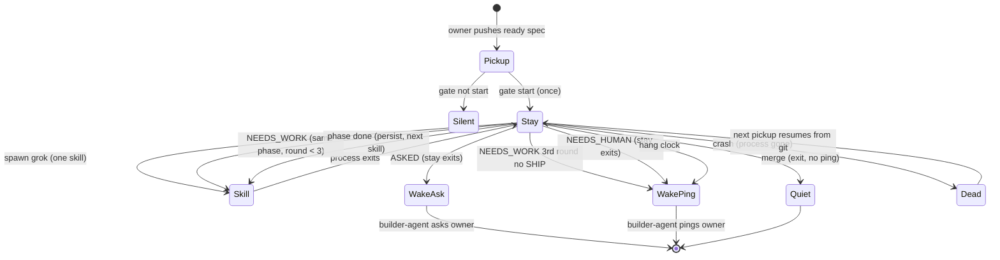

# Factory stay worker

## Conversation Evidence

> user (turn 1): "This is a NEW spec. Do not rewrite fn-1, fn-2, or fn-3. Suggested id: fn-4-factory-stay-worker."

> user (turn 1): "Do NOT mark ready. Do NOT implement. Do NOT write Bun. The spec IS the state machine / outcome map. If a verdict has no next action, the spec is not ready to build. Map first, Bun later."

> user (turn 1): "Keep generic: owner / GitHub / builder / notify. No personal names. No secrets."

> user (turn 1, PICKUP): "Owner pushes a ready spec. Factory picks it up. That surface stays. Tick-per-push is the flake. Kill it. Webhook is pickup only, once. Later pushes resume-or-ignore, not a new tick. Single-flight: one spec / one branch at a time."

> user (turn 1, STAY): "One worker stays on that spec until merge or NEEDS_HUMAN. Same session through land. Stopping at make-pr / PR-up is the lottery again. If merge needs the owner's yes, that is ASKED in this session, not a new pickup. Persist after every phase (commit and push the spec branch if the tree moved). That is crash insurance on the same tree, not a new wake. git is the resume disk. Crash: no ping; next start resumes the next phase from git."

> user (turn 1, NOT PILOT): "Factory does not call /pilot. /pilot is one phase then exit. /loop calling /pilot once and dying is what we lived. Factory calls the real skills: plan, plan-review, work-rolling, make-pr, land. /pilot stays a human /loop tool."

> user (turn 1, DISPATCH): "Skip-planning mark set before the push: skip plan and plan-review, go to work-rolling. No skip mark and no tasks: walk all phases (plan, plan-review, work-rolling, make-pr, land). Tasks on disk and no skip mark: work what is there (work-rolling). Native flow-next only has `ready`. There is no native ready-to-work vs ready-to-plan key yet. The skip/plan-offload mark is a factory field until Gordon ships a native one. Do not teach it in easy-install as the product. If Gordon ships native statuses, read his."

> user (turn 1, WORK-ROLLING): "Always invoke /flow-next:work-rolling (not /flow-next:work). Host stays grok. On grok this degrades to wave; take the wave. Do not add a Claude host just to roll. cursor-agent for Sol review is a child of the stay script when a phase needs review, not a new builder-agent turn."

> user (turn 1, WORKER): "A Bun TypeScript program, same family as the existing factory program (gate + tick). Three programs, one child: webhook hits gate (start or silent); a new stay script is the loop; it spawns grok with one skill, waits until that process exits, commits, spawns the next. Not a Grok Bot subagent. Not the builder agent in the loop. Hang clock lives in the stay script. Silence past it is NEEDS_HUMAN in this session, not another pickup. No 20-minute poll. Dumb loop, smart skills. grok and Sol steer. NEEDS_WORK means run them again."

> user (turn 1, OUTCOME MAP): "NEEDS_WORK → same phase again (keep working; do not ask the owner). Phase done → persist, next skill. Merge → exit, quiet. ASKED → stay script exits; that exit is the one builder-agent wake; ask the owner. NEEDS_HUMAN → stay script exits; that exit is the one builder-agent wake; ping the owner. Hang clock → same as NEEDS_HUMAN. Crash → process gone; git has the phase; next pickup/resume continues. No ping. The only builder-agent wake is that stay-script exit. The wrap that waits on the Bun process lives in the shipped webhook path (a worker that holds until the stay script exits). Background Shell will not notify. This is factory, not a builder habit. Other installs must get the NEEDS_HUMAN ping."

> user (turn 1, OUT OF SCOPE): "Visibility board (what phase, still on it). Later. Second ready spec while one stay is running. Later. Same-account easy-install e2e. Later. Grok Bot platform wake-miss (ACK 200, no turn). Not this program. Teaching the factory-only plan key in easy-install."

> user (turn 1, STYLE): "Spec is the map. Concrete. Terse. Acceptance criteria from these locks only. ready=false. Draft."

> user (turn 2): "How do we detect non converging work? If impl-review keeps finding issues we need some sort of escalation mechanism"

> user (turn 2, locked): "NEEDS_WORK is not forever. Same phase, three rounds without SHIP → NEEDS_HUMAN. Same majors after a fix are one round. A commit that does not answer the last review does not reset the count. Only a commit that answers the last review is progress. Hang clock is time. This cap is not-converging."

> user (turn 3): "Yes on install, if pickup changes. fn-3 still says gate then tick.ts. If the wrap + stay script is the new first action, this spec should update that README/skill beat. Not a second spec. Leave tick.ts as the old one-phase path or delete it. Do not leave both as the advertised start."

## Goal & Context
<!-- scope: business -->

<!-- Source-tag breakdown: 90% [user] / 10% [paraphrase] -->

The owner pushes a ready spec. Factory picks it up. That pickup surface stays. [user]

Tick-per-push is the flake. Kill it. `/loop` calling `/pilot` once and dying is what we lived. Stopping at make-pr / PR-up is the lottery again. [user]

One worker stays on that spec until merge or NEEDS_HUMAN. Same session through land. This spec is the state machine / outcome map. If a verdict has no next action, the spec is not ready to build. Map first, Bun later. [user]

Roles stay generic: owner / GitHub / builder / notify. No personal names. No secrets. [user]

This capture is draft. `ready=false`. Do not implement in this spec. [user]

New spec. Does not rewrite fn-1, fn-2, or fn-3. [user]

## Architecture & Data Models
<!-- scope: technical -->

<!-- Source-tag breakdown: 85% [user] / 15% [paraphrase] -->

Three programs, one child. [user]

1. **Gate.** Webhook hits gate. Start or silent. Pickup only, once. [user]
2. **Stay script.** The loop. A Bun TypeScript program, same family as the existing factory program (gate + tick). Spawns grok with one skill, waits until that process exits, persists, spawns the next. Hang clock lives here. [user]
3. **Child.** grok, one skill per spawn. Skills: plan, plan-review, work-rolling, make-pr, land. Never `/pilot`. [user]

**Wrap.** The shipped webhook path holds until the stay script exits. That exit is the one builder-agent wake. Background Shell will not notify. This is factory, not a builder habit. Other installs must get the NEEDS_HUMAN ping. [user]

The stay script is not a Grok Bot subagent. The builder agent is not in the loop. [user]

`cursor-agent` for Sol review is a child of the stay script when a phase needs review. It is not a new builder-agent turn. [user]

Host stays grok. On grok, work-rolling degrades to wave. Take the wave. Do not add a Claude host just to roll. [user]

Dumb loop, smart skills. grok and Sol steer. [user]

**Resume disk.** git. Persist after every phase: commit and push the spec branch if the tree moved. Crash insurance on the same tree, not a new wake. Crash: process gone, no ping. Next start resumes the next phase from git. [user]

**Single-flight.** One spec / one branch at a time. [user]

## API Contracts
<!-- scope: technical -->

The tables are the contract. Shown fields are the whole shape.

### Pickup

Webhook is pickup only, once. Later pushes resume-or-ignore, not a new tick. [user]

| Event | Action |
| --- | --- |
| Owner pushes a ready spec. No stay on that spec/branch. | Gate start. Stay script begins. |
| Later push while stay is running. | Ignore. Not a new tick. |
| Later push after crash (process gone; git has the phase). | Resume the next phase from git. Not a new tick. |
| Gate does not start. | Silent. No stay. No ping. |

### Dispatch

Native flow-next only has `ready`. There is no native ready-to-work vs ready-to-plan key yet. The skip/plan-offload mark is a factory field until native flow-next ships equivalent statuses. Then read native. Do not teach the factory field in easy-install as the product. [user] [paraphrase]

| Skip-planning mark (set before the push) | Tasks on disk | First skill |
| --- | --- | --- |
| set | any | work-rolling (skip plan and plan-review) |
| unset | none | plan, then plan-review, then work-rolling, then make-pr, then land |
| unset | present | work-rolling (work what is there) |

Always invoke `/flow-next:work-rolling`. Never `/flow-next:work`. [user]

### Outcome map

Every verdict has a next action. A verdict with no next action means this spec is not ready to build. [user]

| Verdict | Next action | Persist | Builder-agent wake | Owner |
| --- | --- | --- | --- | --- |
| NEEDS_WORK | Same phase again. Keep working. | per phase | no | do not ask |
| Phase done | Next skill. | commit and push spec branch if the tree moved | no | none |
| Merge | Stay script exits. | - | no | quiet |
| ASKED | Stay script exits. That exit is the one builder-agent wake. | - | yes | ask |
| NEEDS_HUMAN | Stay script exits. That exit is the one builder-agent wake. | - | yes | ping |
| Hang clock | Same as NEEDS_HUMAN. | - | yes | ping |
| Crash | Process gone. git has the phase. Next pickup/resume continues. | git already has the phase | no | no ping |

The only builder-agent wake is that stay-script exit. [user]

If merge needs the owner's yes, that is ASKED in this session, not a new pickup. [user]

## Edge Cases & Constraints
<!-- scope: technical -->

- Later push is never a new tick. Resume or ignore only. [user]
- Stopping at make-pr / PR-up fails stay. Land is in the same session. [user]
- Owner-yes merge is ASKED in this session. [user]
- Hang clock lives in the stay script. Silence past it is NEEDS_HUMAN in this session, not another pickup. No 20-minute poll. [user]
- Crash does not ping. Next start resumes the next phase from git. [user]
- Factory invoking `/pilot` fails this spec. `/pilot` stays a human `/loop` tool. [user]
- Adding a Claude host solely so work-rolling can roll fails this spec. Take grok's wave. [user]
- Sol review as a new builder-agent turn fails this spec. It is a stay-script child. [user]
- Background Shell as the wait fails this spec. It will not notify. The wrap lives in the shipped webhook path. [user]
- Second ready spec while one stay is running is out of scope. Single-flight still holds: this spec must not start a second stay. [user]
- Grok Bot platform wake-miss (ACK 200, no turn) is not this program. [user]
- Unbounded NEEDS_WORK. Three rounds, no SHIP, then NEEDS_HUMAN. A commit that ignores the last review does not reset the count. [user]
- Install advertising `tick.ts` as the start after this ships. Stay-script plus wrap is the advertised start. [user]

## Acceptance Criteria
<!-- scope: both -->

- **R1:** Pickup is once. Owner pushes a ready spec. Factory picks it up (that surface stays). Webhook is pickup only, once. Later pushes resume-or-ignore, not a new tick. Single-flight: one spec / one branch at a time. Errors: later push while stay is running → ignore, not a new tick; later push after crash → resume next phase from git, not a new tick; gate not start → silent, no ping; starting a second stay while one is running → fail. [user]

- **R2:** One worker stays on that spec until merge or NEEDS_HUMAN. Same session through land. If merge needs the owner's yes, that is ASKED in this session, not a new pickup. Persist after every phase: commit and push the spec branch if the tree moved. git is the resume disk. Crash: no ping; next start resumes the next phase from git. Errors: stay-script exit at make-pr / PR-up without land → fail; owner-yes merge treated as a new pickup → fail; tree moved and not committed and pushed → fail; crash that pings → fail; crash that starts a new tick from scratch → fail. [user]

- **R3:** Factory does not call `/pilot`. Factory calls the real skills: plan, plan-review, work-rolling, make-pr, land. `/pilot` stays a human `/loop` tool. Errors: factory invoking `/pilot` → fail. [user]

- **R4:** Dispatch matches the API Contracts dispatch table. Skip-planning mark set before the push → skip plan and plan-review, go to work-rolling. No skip mark and no tasks → walk all phases. Tasks on disk and no skip mark → work-rolling. Native flow-next only has `ready`. The skip/plan-offload mark is a factory field until native flow-next ships equivalent statuses. Then read native. Do not teach the factory field in easy-install as the product. Errors: skip mark ignored → fail; walking plan when skip mark was set before the push → fail; teaching the factory-only plan key in easy-install as the product → fail this criterion (out of this spec's product surface). [user] [paraphrase]

- **R5:** Always invoke `/flow-next:work-rolling`, never `/flow-next:work`. Host stays grok. On grok this degrades to wave; take the wave. Do not add a Claude host just to roll. `cursor-agent` for Sol review is a child of the stay script when a phase needs review, not a new builder-agent turn. Errors: invoking `/flow-next:work` → fail; adding a Claude host solely to roll → fail; Sol review as a new builder-agent turn → fail. [user]

- **R6:** The stay script is a Bun TypeScript program in the same family as the existing factory program (gate + tick). Three programs, one child: webhook hits gate (start or silent); the stay script is the loop; it spawns grok with one skill, waits until that process exits, commits, spawns the next. Not a Grok Bot subagent. Not the builder agent in the loop. Hang clock lives in the stay script. Silence past it is NEEDS_HUMAN in this session, not another pickup. No 20-minute poll. Dumb loop, smart skills. grok and Sol steer. NEEDS_WORK means run them again. Errors: builder agent in the loop → fail; Grok Bot subagent as the stay loop → fail; 20-minute poll instead of hang clock → fail; NEEDS_WORK that asks the owner or leaves the phase → fail. [user]

- **R7: The stay script implements the outcome map in API Contracts. Every verdict has the next action listed there. The only builder-agent wake is the stay-script exit (ASKED or NEEDS_HUMAN, including hang clock). The wrap that waits on the Bun process lives in the shipped webhook path (a worker that holds until the stay script exits). Background Shell will not notify. Other installs must get the NEEDS_HUMAN ping. Merge → exit, quiet. Crash → no ping; next pickup/resume continues from git. Errors: a verdict with no next action → fail (spec not ready to build); missing wrap so NEEDS_HUMAN never pings → fail; Background Shell as the wait → fail; builder-agent wake on phase-done, NEEDS_WORK, merge, or crash → fail. [user]

## Boundaries
<!-- scope: business -->

- Visibility board (what phase, still on it). Later. [user]
- Second ready spec while one stay is running (queue/switch). Later. Single-flight in R1 still holds. [user]
- Same-account easy-install e2e. Later. [user]
- Grok Bot platform wake-miss (ACK 200, no turn). Not this program. [user]
- Teaching the factory-only plan key in easy-install as the product (the skip mark). Updating the advertised pickup to stay-script plus wrap is this spec (R9). [user]
- Implementing the Bun stay program in this spec. Map first, Bun later. This spec does not write the program. [user]
- Rewrite of fn-1, fn-2, or fn-3. [user]
- Personal names. Secrets. [user]

## Decision Context
<!-- scope: both — conditionally substructured -->

### Motivation
<!-- scope: business -->

Tick-per-push is the flake. `/loop` calling `/pilot` once and dying is what we lived. Stopping at make-pr / PR-up is the lottery again. [user]

Stay through land so merge or NEEDS_HUMAN / ASKED happens in this session. Owner-yes merge is ASKED here, not a new pickup. [user]

The wrap lives in the shipped webhook path because Background Shell will not notify. Other installs must get the NEEDS_HUMAN ping. That is factory, not a builder habit. [user]

Map first. If a verdict has no next action, the spec is not ready to build. Bun later. [user]

## Parked unknowns

- Hang clock duration. Locked: silence past it is NEEDS_HUMAN in this session, no 20-minute poll. The number is unset. Resolve at plan. [user]

## Requirement coverage

| R-ID | Task | Notes |
| --- | --- | --- |
| R1 | fn-4.M (TBD - populate via /flow-next:plan) | Pickup once, resume-or-ignore, single-flight |
| R2 | fn-4.M (TBD - populate via /flow-next:plan) | Stay through land, persist, git resume |
| R3 | fn-4.M (TBD - populate via /flow-next:plan) | Real skills, never /pilot |
| R4 | fn-4.M (TBD - populate via /flow-next:plan) | Dispatch table, factory skip mark |
| R5 | fn-4.M (TBD - populate via /flow-next:plan) | work-rolling, grok wave, Sol child |
| R6 | fn-4.M (TBD - populate via /flow-next:plan) | Stay script shape, hang clock, dumb loop |
| R7 | fn-4.M (TBD - populate via /flow-next:plan) | Outcome map + webhook wrap |
| R8 | fn-4.M (TBD - populate via /flow-next:plan) | Three-round NEEDS_WORK cap |
| R9 | fn-4.M (TBD - populate via /flow-next:plan) | Install advertises stay+wrap, not tick.ts |
