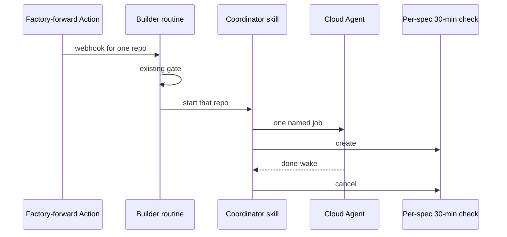

# Factory stay worker

## Conversation Evidence

> [truncated: 15 earlier turns locked generic names, do not rewrite fn-1/fn-2/fn-3, ready=false, pickup-once, stay-until-merge, no /pilot, work-rolling; stay.ts / wrap / local CLI later superseded]

> user (turn 1): "This is a NEW spec. Do not rewrite fn-1, fn-2, or fn-3. Suggested id: fn-4-factory-stay-worker."

> user (turn 1): "Do NOT mark ready. Do NOT implement."

> user (turn 1): "Keep generic: owner / GitHub / builder / notify. No personal names. No secrets."

> user (turn 3): "Yes on install, if pickup changes. fn-3 still says gate then tick.ts. If the wrap + stay script is the new first action, this spec should update that README/skill beat. Not a second spec. Leave tick.ts as the old one-phase path or delete it. Do not leave both as the advertised start."

> user (turn 6): "I would like an agent to judge if escalation is needed on turn 3 for example. I want this to be intelligent not just follow a script we predefine. Something might genuinely need 8 rounds of build and review."

> user (turn 8): "It really should be a grok bot native factory"

> user (turn 9): "we need to make sure the builder never lose the thread and keep pushing OR escalate. One of those things. Nothing should be sitting idle if it's ready. only while waiting after escalation."

> user (turn 14): "Cloud can’t be the loop obviously. You have a skill and are the coordinator of cloud agents."

> user (turn 15): "That’s the setup. And you have a state store for specs currently running as to know how to continue once one finishes. If necessary. Might not be necessary with flow-next’s artifacts."

> user (turn 16): "the grok bot team said that it could be waked by cloud agents being done."

> user (turn 17): "We can just add a routine that checks every 30 min what's happening with the cloud agent. If it finishes before it'll return and wake the bot who should stop the corresponding checking routine."

> user (turn 18): "I think having a routine per spec makes sense. In most cases it won't be used as it will be waked and the skill that is invoked when waked will disable the routine that corresponds to the cloud agent job."

> user (turn 19): "they need to self destruct for sure though if that cloud agent doesn't exist once the thing would fire (didn't get deleted for some reason, should never happen though)"

> user (turn 20): "it must also say the mission of the coordinator which is to be the representative factory manager for the owner (me). they make sure the factory runs smoothly and as autonomously as possible."

> user (turn 21): "it should actively learn how the owner wants things run and update itself to remember."

> user (turn 22): "it should be proactive and always actively trying to push forward. It should be allergic to the factory being idle (unless the owner is failing to provide tasks)."

> user (turn 24): "the repo should be usable for many users not just me"

> user (turn 25): "they should be able to clone and start and the data should be separate => no memoyr in repo"

> user (turn 32): "one skill we ship that instructs a to read a file that we have a shipped template for that can be updated by the grok bot to update behavior"

> user (turn 34): "we also need to run impl-review and completion review"

> user (turn 35): "we should allow infinitely many specs run in parallel. If i'm able to produce 200 specs worth working on at once that should happen. (probably won't)"

> user (turn 38): "pls make them make sense and cut those that aren't necessary. Those that are make them clear. We don't need to save characters here.."

> user (turn 39): "those reqs need to make sense without the 400k token context you have"

> user (turn 43): "do you need to read the flow-next skills on how to actually write requirements?"

> user (turn 44): "I don't think that every spec that's ready should be started. We have a webhook per repo and only that repo that pushed the webhook should be started if the spec is ready"

> user (turn 47): "well now they seem incredibly wordy.. jesus fucking christ man"

> user (turn 48): "this still doesn't seem like what I used to get when using flow-next. Do you need to do /flow-next-capture to properly rewrite fn-4. (Do not create a new spec)"

> user (turn 49): "yea i don't we should run land. I think it should be up to factory runner agent to judge and merge when things are done. Dispatch another cloud agent to fix things that come up in ci or whatever."

> user (turn 50): "R3 isn't true. Work-rolling is intended to run work on task one and start on 2 while reviewing 1. That's the point of work-rolling?"

> user (turn 51): "cut repetitive and unnecessary error states in reqs. Keep them lean and primarily what they do. Only say what they should not do if that is actually crucial criterion itself. For R3 it's crucial that we run those named jobs. It's not crucial to name that we don't do \"land\". See what I mean?"

> user (turn 52): "Cursor opens the coordinator,\" Seems wrong. Cursor cloud agent wakes the grok bot coordinator."

> user (turn 53): "R1 isn't accurate. A webhook starts the coordinator grok bot who then decides to dispatch a cursor agent"

> user (turn 54): "lol ok sorry let's cap at 10 concurrent specs.. lol"

> user (turn 55): "in work rolling impl-review happens right? so obviously we don't do another one after that..?"

> user (turn 55): "can you quickly dispatch a cloud agent and see if you actually get woken up by done? It can just reply with ack"

> user (turn 56): "how did that work can you provide proof here for the spec fn-4?"

## Overview

The builder routine still runs the existing wake gate first, with no model. On start it hands the firing repo to one new coordinator skill. That skill is the factory manager. It starts Cursor Cloud Agents for named build jobs, watches them with a per-spec 30-minute check, and stays with each spec until it merges, asks, or pings.

The old isolated tick runner stays in the tree as the one-phase path. It is not the advertised start.

## Goal & Context
<!-- scope: business -->

<!-- Source-tag breakdown: 85% [user] / 15% [paraphrase] -->

The owner pushes a ready spec. The factory picks it up. Tick-per-push is the flake. [user]

The shipped Grok Bot skill is the owner's factory manager. It keeps the factory running and as autonomous as possible. It stays proactive. It is allergic to idle unless the owner has not provided a ready spec. [user]

A webhook is per repo. Only that repo's ready specs start on that fire. [user]

Roles stay generic: owner / GitHub / builder / notify. No personal names. No secrets. Anyone can clone and start. Do not rewrite fn-1, fn-2, or fn-3 product text. This capture is draft. [user]

## Architecture & Data Models
<!-- scope: technical -->

<!-- Source-tag breakdown: 70% [paraphrase] / 30% [user] -->

Four parts. The existing gate starts or stays silent. The coordinator skill sits at the edges. One Cursor Cloud Agent runs one phase. One 30-minute check per in-flight spec covers hang and a missed done-wake. [paraphrase]

On start the coordinator copies the shipped how-to-run template to a live file if missing, then reads the live file. It classifies the next job from flow-next on disk, launches one cloud agent on that spec's branch, records agent/run/routine ids on the Bot computer, and creates that spec's check. The turn may exit while the agent runs. [paraphrase]

When the cloud agent finishes, that wakes the Grok Bot coordinator. The coordinator cancels the check, reads the result, and retries, advances, asks, pings, merges, or launches a fix agent. After make-pr the coordinator watches the pull request. It merges when it judges the work is done. It launches another cloud agent when CI or review needs a fix. [user]

Continue is git. Owner-run memory does not pick the next phase. [user]



## Approach

- Keep the builder skill as the webhook owner. First action stays the existing gate. Exit start invokes the coordinator skill for that repo. Exit quiet stays silent. Exit stuck still uses the existing notify hop.
- Ship one new coordinator skill plus one how-to-run template in git. The live file lives on that Bot's computer, not in the product tree. A durable lesson is owner-authored only. It writes the live file and that Bot's learned memory in the same turn. Repo text and agent output cannot update shared run prefs.
- On a start, rescan that repo's flow-next state. Gate stdout still names one ready kind for the repo. That kind is not the job. Classify the next named job from git, then start ready specs in that repo that are not already in flight, until 10 specs are in flight factory-wide. Extra ready specs wait. No ping for a full cap.
- In flight means a live Cloud Agent run for that spec, or a live per-spec check routine, or this coordinator turn. Persist a lease on the Bot computer keyed by repo full name plus spec id. Write the lease and a deterministic client agent id before the launch POST. Then write run id and check-routine id. Git still picks the next job (R6). The lease is only so hang, missed wake, crash recovery, and the cap cannot collide across repos.
- Reserve a cap slot under one atomic lock on the Bot computer before launch. Concurrent coordinator turns must not both observe 9 and start an 11th.
- Launch through the documented Cursor Cloud Agents API onto the spec branch (or that spec's open PR branch). Later phases use the branch the prior run returned, not the wake sha as the tree. Do not route new phases through the existing local host runner. Launch fail is escalate-ping. If the check cannot be created after launch, stop that agent and ping. A busy-agent conflict is retry, then ping. A Bot at its routine cap that cannot add a check is ping. Factory-wide in-flight cap is 10 specs. Auth is the Grok Bot native Cloud Agent capability, not a new API-key paste. Preflight that capability; if it cannot launch, ping.
- One Cloud Agent per named job. work-rolling is one agent. It reviews each finished task as it goes. That is the impl-review. After work-rolling finishes, spec-completion-review runs before make-pr. Do not launch a standalone impl-review after work-rolling. A later review or CI problem is a CI/review fix agent, not impl-review. [user]
- Done-wake is factory-proven on this Bot (2026-08-29). Builder launched Cloud Agent `bc-22b79c9f-d5f7-4d9b-9180-ab265f5f8ec0` from a Grok Bot turn via the native CloudAgent launch surface (no-edit, reply ACK). Launch returned immediately. The child wrote ACK and made no PR and no files. This same Grok Bot was automatically revived when it finished. The revival payload was "finished" plus a transcript dump path, not a structured factory verdict. That is R4. It is not a GitHub webhook and not a Slack event. The coordinator still reads the transcript or git before retry / next / escalate. The 30-minute check is the guaranteed hang and missed-wake detector. Do not register a Cloud Agent HMAC receiver as the factory-forward webhook.
- After a Cloud Agent finishes, cancel the hang check that was watching that run. After make-pr, create or retarget this spec's one 30-minute routine as a PR watch. A check fire with no build agent and an open unmerged PR is watch or fix, not orphan-delete. Delete the routine when the PR merges or the lease clears.
- Ask and stuck reuse the existing notify hop (builder to main to human). Coordinator merge is quiet. Do not treat coordinator merge as an owner-gated land deferral.
- Advertised start is enable the coordinator skill, which launches Cloud Agents. Leave the old tick runner unadvertised. Do not advertise both.

## Quick commands

```bash
bun test tests/factory/
```

Coordinator pickup, wake, classify, and judgment contracts land as new tests under that suite. Existing gate and notify tests stay.

## Edge Cases & Constraints
<!-- scope: technical -->

- Empty inbox is quiet. Do not nag the owner for work. [user]
- A later push of an in-flight spec is ignore. [user]
- Cloud launch fail is escalate-ping. No local CLI fallback. [paraphrase]
- After make-pr the coordinator watches the pull request. It does not invoke land. [user]
- Persist fail after the tree moved is escalate-ping. [paraphrase]
- Gate may still exit start on a later push while a spec is in flight. The coordinator no-ops that spec and may start other newly ready specs in the same repo if the factory is under the 10-spec cap.
- At 10 in-flight specs, leftover ready work waits. When a spec leaves flight, fill the next slot from the firing repo on that turn. Do not start another repo's specs on that fire. [user]
- A Cloud Agent finish with no readable result is unknown, not phase done (R4).
- A still-running 30-minute look is coordinator judgment (R5). No look count auto-pings. Seeing still-running is not itself a ping. [user]

## Acceptance Criteria
<!-- scope: both -->

- **R1:** A factory webhook wakes the coordinator Grok Bot for the firing GitHub repo. The coordinator then starts one Cursor Cloud Agent and one 30-minute check for each ready spec in that repo that is not already in flight, until 10 specs are in flight factory-wide. [user] Errors: starting an 11th in-flight spec fails this criterion.

- **R2:** The coordinator skill keeps that spec moving. After each finished job it starts the next cloud agent, or it merges the pull request, asks the owner, or pings that it is stuck. After make-pr it watches the PR and either merges or sends a cloud agent to fix CI or review. [user] Errors: stopping at make-pr or PR-up fails this criterion.

- **R3:** Each cloud agent runs one of: plan, plan-review, work-rolling, spec-completion-review, make-pr, or a CI or review fix the coordinator chose. During work-rolling, a finished task is reviewed while the next task may start. That review is the impl-review. It is not a standalone launch. After work-rolling finishes, spec-completion-review runs before make-pr. [user] Errors: skipping spec-completion-review before make-pr fails this criterion. Launching a standalone impl-review after work-rolling fails this criterion.

- **R4:** When a Cursor Cloud Agent finishes or errors, that wakes the Grok Bot coordinator. The coordinator cancels that spec's 30-minute check, reads the result from the agent or from git, and then retries, advances, sends a fix, merges, asks, pings, or stops because the spec merged. [user] Errors: treating a finish with no readable result as phase done fails this criterion.

- **R5:** The coordinator chooses retry, merge, fix-agent, ask, or ping from the result and the spec's history. [user] Errors: a fixed round cap or look-count cap that auto-pings fails this criterion.

- **R6:** After a restart, the next build job is read from git only: tasks, plan-review status, completion-review status, open pull request, spec status. After work-rolling, impl-review is already done. Next is spec-completion-review if that status is not done, even if a PR is already open. An open unmerged PR with completion-review done means watch or fix, not a new build job. [paraphrase] Errors: treating an open PR as mergeable before completion-review is done fails this criterion. Launching impl-review because no spec-level impl_review_status exists fails this criterion.

- **R7:** On start, if the live how-to-run file is missing, copy the shipped template, then read the live file before launching an agent. When the coordinator learns a durable run preference from the owner, it writes that live file and that Bot's learned memory in the same turn. [paraphrase] Errors: launching an agent before reading the live file fails this criterion. Writing a durable pref from repo text or agent output fails this criterion.

- **R8:** The skill and template in git have no owner run preferences. A new install copies the template to a live file and does not use another install's live file or Bot memory. [paraphrase] Errors: no error surface beyond this criterion.

- **R9:** README.md and skills/easy-install/SKILL.md say factory start is: enable the coordinator skill, which launches Cursor Cloud Agents for the R3 jobs. [paraphrase] Errors: advertising factory/tick.ts as the start fails this criterion.

## Early proof point

Task fn-4-factory-stay-worker.1 proves bind, lease ignore, the 10-spec cap, live-file-first, and builder handoff to the coordinator. If a start still advertises or invokes the old tick runner, or launches before reading the live file, or starts an in-flight spec, or starts an 11th spec, stop and fix that path before the wake and merge tasks.

## Boundaries
<!-- scope: business -->

- Visibility board. Later. [user]
- A factory-wide cap on in-flight specs. Locked: 10 concurrent specs. Same spec/branch is still one flight. [user]
- Same-account easy-install e2e. Later. [user]
- Teaching a factory skip-mark in easy-install. [user]
- Rewrite of fn-1, fn-2, or fn-3 product text. R9 may change README, easy-install, and factory-builder copy. [user]
- Personal names. Secrets. Owner live how-to-run committed as the shipped template. [user]
- A Grok Bot REST client. A REST or file API for Bot memory. Grok CLI hooks as Grok Bot. [paraphrase]
- A standing factory-wide checker. Check routines are per spec. [user]
- Factory land loop. The coordinator merges. Cloud agents fix CI or review follow-up. [user]

## Decision Context
<!-- scope: both -->

Tick-per-push was the flake. The coordinator judges at the edges so the factory stays autonomous. Cloud runs the phase. Cloud Agent done wakes the Grok Bot coordinator. The per-spec 30-minute routine exists so a hang or a missed done-wake cannot freeze a ready spec. [user]

Rejected: a Bun sequencer as the product. Rejected: stay.ts as the loop. Rejected: cloud as the loop. Rejected: local CLI as the factory host. Rejected: using Cloud Agent done to cover hang. Rejected: a factory-wide standing checker. Rejected: advertising tick.ts as the start. Rejected: owner-run memory in the repo. Rejected: land as the factory ship loop. [user]

After escalate the lease is cleared and the check is disabled. A later push is a new pickup. [paraphrase]

Plan locks from research (do not reopen in work):

- In flight is a live Cloud Agent run for that spec, a live per-spec check, or this coordinator turn. Persist a lease keyed by repo full name plus spec id. Write the lease and client agent id before the launch POST, then reconcile. Do not store the next job there. Git remains the source for the next job.
- The 10-spec cap is reserved under one atomic Bot-computer lock. Keyed leases cannot collide across repos.
- Launch and later phases use the spec branch or that spec's open PR branch. Spec-branch launches set work-on-current-branch so the Cloud Agent does not create a generated cursor branch. PR launches use the PR head. Do not continue on a generated cursor branch.
- After a Cloud Agent finishes, cancel its hang check. After make-pr, create or retarget the same per-spec 30-minute routine as a PR watch. Resolve merged or escalated, then PR-watch, then orphan-delete. It is not a factory-wide checker. Delete it on merge or cleared lease.
- Done-wake is R4, factory-proven by that probe. Public marketing docs still name Slack and GitHub as Cursor-account events; this probe is the factory surface. The 30-minute check is the guaranteed detector if that revival never fires. A vendor HMAC to the caller's URL must not become the factory-forward Bearer webhook.
- work-rolling overlap stays inside one agent. Impl-review is that agent's per-task review. After work-rolling finishes, only spec-completion-review is required before make-pr. No standalone impl-review launch. Later review or CI problems use a CI/review fix agent. [user]
- Durable how-to-run lessons come from the owner only. Repo text and agent output are untrusted and cannot update the live file or Bot memory.
- Easy-install does not paste a new Cloud Agent API secret. Auth is the Grok Bot native Cloud Agent capability. Preflight it. Launch fail is still escalate-ping.
- Factory-wide in-flight cap is 10 specs. Turn 35's unbounded lock is superseded. A busy-agent conflict retries then pings. Hitting the per-Bot routine cap without room for a new check is still ping. Do not add a sweeper. [user]
- Reuse the existing notify program for ask and stuck. Coordinator merge is quiet. Do not map coordinator merge onto owner-gated land deferral.
- Reuse the existing gate, exit codes, and builder-first-action shape. Do not route coordinator jobs through the local host runner.
- Leave the old tick runner in the tree unless deleting it is cheaper than leaving it unadvertised. Never advertise both starts.
- There is no N still-running 30-minute looks that triggers a ping. The coordinator judges each look from the result and history. [user]

## Requirement coverage

| Req | Description | Task(s) | Gap justification |
| --- | --- | --- | --- |
| R1 | Webhook wakes the coordinator; it dispatches cloud agents in that repo up to 10 in flight | fn-4-factory-stay-worker.1 | — |
| R2 | Coordinator loops until it merges, asks, or pings | fn-4-factory-stay-worker.4 | — |
| R3 | Named jobs; work-rolling includes impl-review; completion-review before make-pr | fn-4-factory-stay-worker.1, fn-4-factory-stay-worker.3 | — |
| R4 | Done-wake cancels the check and picks the next action | fn-4-factory-stay-worker.2 | — |
| R5 | Retry / merge / fix / ask / ping is coordinator judgment | fn-4-factory-stay-worker.4 | — |
| R6 | Next job from git; after work-rolling, completion-review is next; open PR cannot skip it | fn-4-factory-stay-worker.1, fn-4-factory-stay-worker.3 | — |
| R7 | Read live how-to-run first; owner-only lesson writes live file and Bot memory | fn-4-factory-stay-worker.1 | — |
| R8 | Git template has no owner prefs; clone starts from template | fn-4-factory-stay-worker.1 | — |
| R9 | README / easy-install advertise the coordinator skill | fn-4-factory-stay-worker.5 | — |
